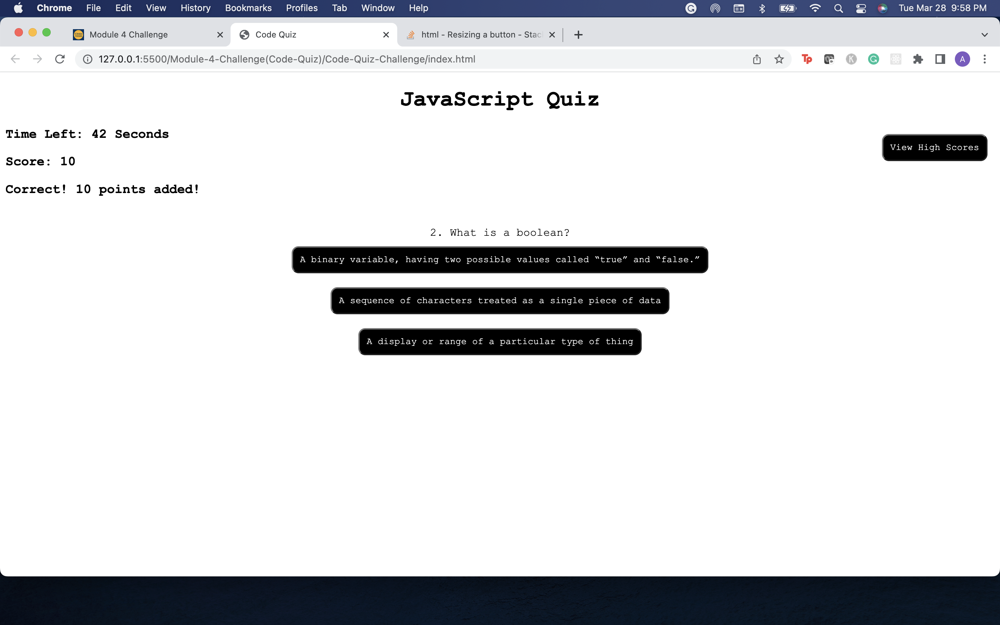
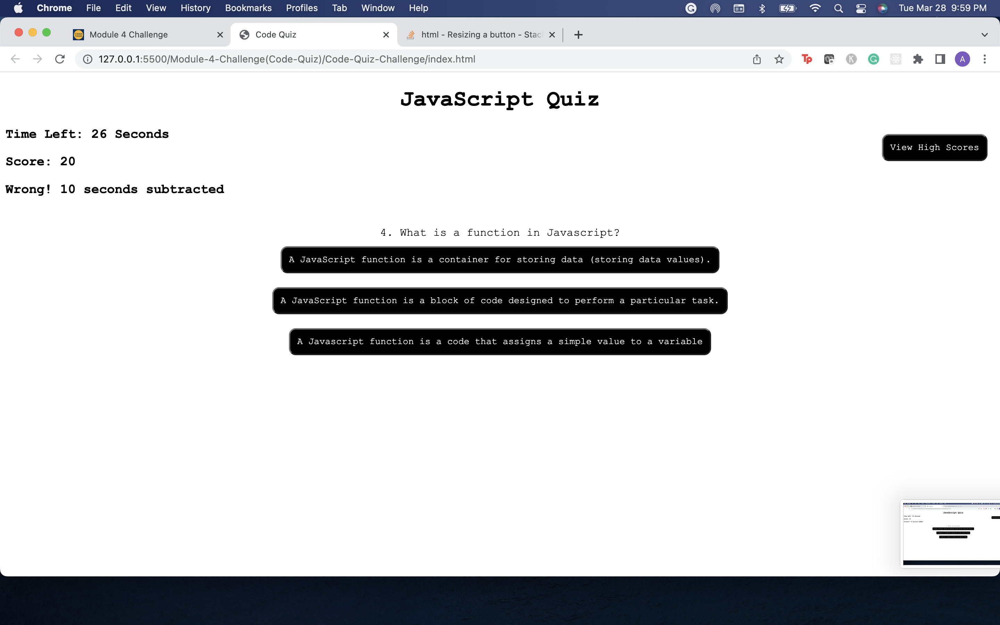
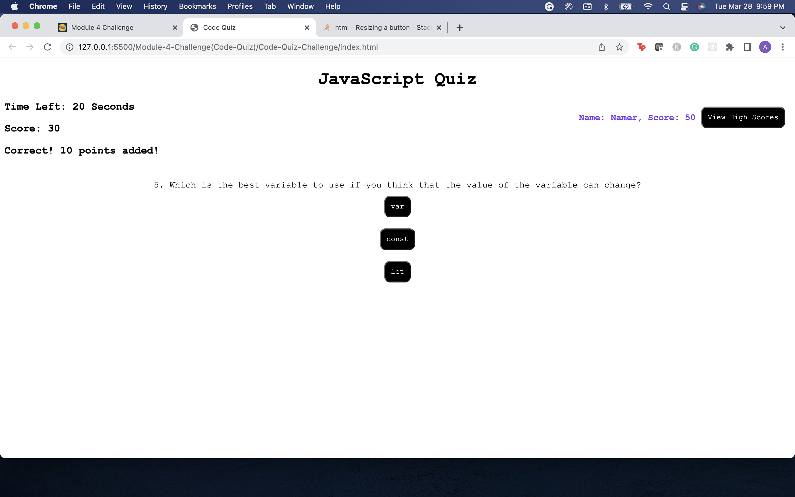
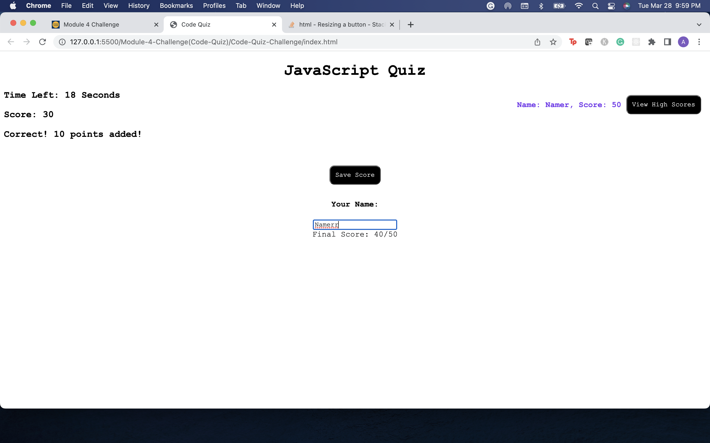

# Code Quiz Challenge 

## Description 
A short Javascript quiz where the user has to answer questions in alotted time. Time will be subtracted when the user answers incorrectly and points will be added when answered correctly. At the end of the quiz the user has the option to save their score to local storage.

## Table of Contents

 [Installation](#Installation)

 [Examples] (#Examples)

    
 [Use](#Use)

    
 [License](#License)

    
 [Credits](#Credits)

    
 [Tests](#Tests)

    
 [Questions](#Questions)

## Installation
Go to the deployed link and press start quiz button

## Examples

## Usage

## Contributing

## Tests

## Questions

Have questions? Email me at adenamarom@gmail.com or find me on ![GitHub] (https://github.com/AdMarom)!